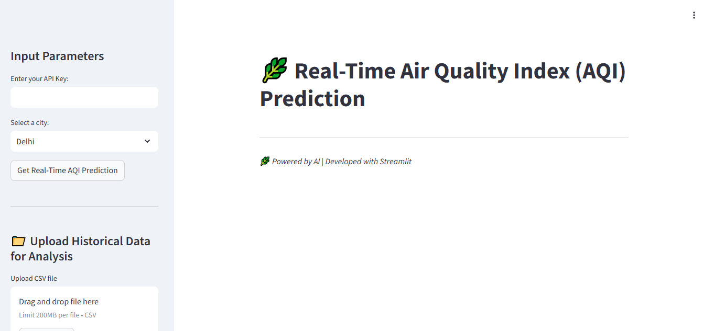
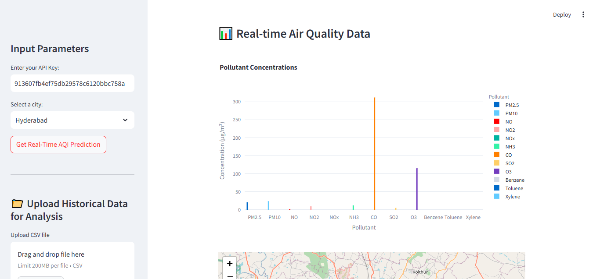
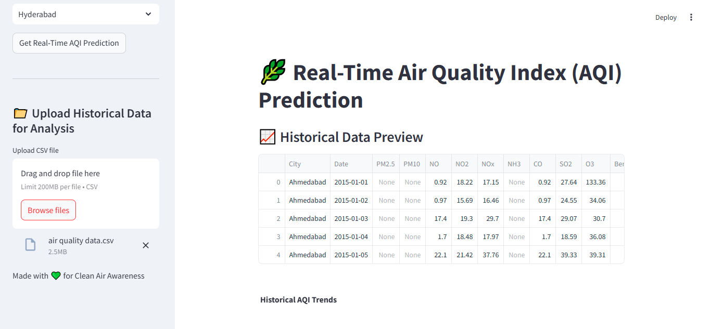
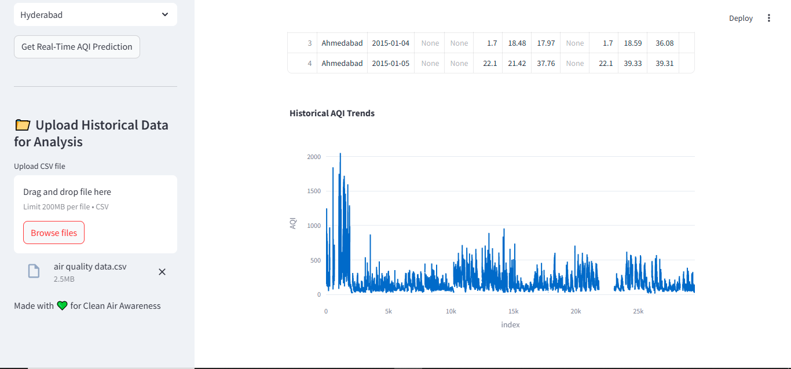

# 🌿 AirWatcher, A Real-Time Air Quality Prediction System
## 📋 Project Overview
This project develops an AI-powered model using machine learning techniques to predict Air Quality Index (AQI) based on environmental data fetched from the OpenWeatherMap API and visualizes pollutant levels and AQI categories interactively. It aims to provide accurate forecasts, helping in proactive pollution management and public health awareness.
<div align="center">
  
</div>

## ✨ Features

- Real-time AQI Prediction: Uses pollutant data (PM2.5, PM10, NO2, CO, etc.) to predict AQI.

- Interactive UI: Built with Streamlit for a user-friendly interface.

- Data Visualization: Displays pollutant concentrations using dynamic bar charts.

- AQI Interpretation: Shows AQI categories (Good, Moderate, Unhealthy, etc.) with color-coded results.

- Historical Data Analysis: Allows users to upload CSV files for custom data analysis.

- Real-time Data Fetch: Integrates with OpenWeatherMap's Air Pollution API.

## 🚀 Tech Stack

**Programming Language:** Python

**Libraries:** Streamlit, Pandas, NumPy, Scikit-learn, Joblib, Requests, Plotly

**Machine Learning Model:** Random Forest Regressor (or Linear Regression, based on your choice)

**API:** OpenWeatherMap Air Pollution API

## 📸 Application Screenshots

### 🔹 Real-time Pollutant Concentrations

This screen displays a bar chart of various pollutant concentrations (like PM2.5, NO2, CO, etc.) in the selected city using real-time air quality data fetched via API.

---

### 🔹 Predicted AQI with Location Map

After selecting a city and providing an API key, the application fetches data, maps the location, and shows the predicted AQI along with a health recommendation message.

---

### 🔹 Upload Historical Data

Users can upload historical air quality data in CSV format. The application previews this data in a clean, tabular format showing pollutant levels by city and date.

---

### 🔹 Historical AQI Trends Visualization

This graph visualizes the AQI trend over time from the uploaded historical dataset, helping to analyze changes in air quality across days or years.

---

> 🧠 This tool helps users understand current air quality and analyze long-term trends using both real-time and historical data.

## 📦 Project Structure
```
├── aqi_app.py                  # Main Streamlit app for real-time AQI prediction
├── aqi_model.pkl               # Trained ML model
├── scaler.pkl                  # Scaler for input feature normalization
├── air_quality_data.csv        # Sample dataset for training/testing
├── README.md                   # Project documentation
└── requirements.txt            # Python dependencies
└── .gitignore                  # Git ignored files
```

## ⚠️ Note

- The machine learning model (aqi_model.pkl) is not included in this repository due to GitHub's file size limitations.
- To use the app, you can train your own model or request the file separately.
  
## 📊 How to Run the Project

**1. Clone the repository** 
```
git clone https://github.com/yourusername/aqi-prediction.git
cd aqi-prediction
 ```
**2. Install dependencies**
 ```
pip install -r requirements.txt
 ```
**3. Run the Streamlit app**
 ```
streamlit run aqi_app.py
 ```
**4. Interact with the app**
- Enter your OpenWeatherMap API key.

- Input latitude and longitude to fetch real-time air quality data.

- Click Get Real-Time AQI Prediction.

- View the pollutant chart and AQI result.

- Optionally, upload a CSV file to analyze historical AQI data.

## 🌐 How to Get OpenWeatherMap API Key
1. Sign up at OpenWeatherMap.

2. Go to API Keys under your profile.

3. Copy the API key and paste it into the app when prompted.

 ## 💡 Future Improvements
- Live AQI Map: Display AQI levels on an interactive map.

- Push Notifications: Alert users for hazardous AQI levels.

- Multiple Models: Allow users to choose different ML models for prediction.

- Cloud Deployment: Host the app on platforms like Heroku or AWS.
  
 ## 📧 Contact

For any questions or feedback, feel free to reach out!
